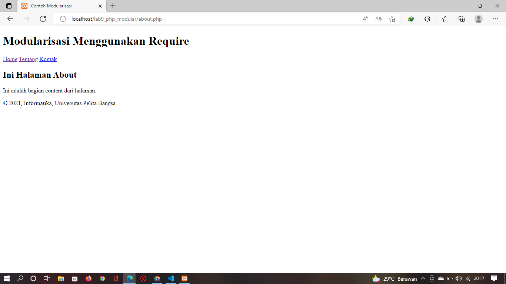

# Lab9Web

## Nama : Prananda Aditya

## NIM : 312010130

## Kelas : TI.20.A1

## Mata Kuliah : Pemoggraman Web

# langkah langkah praktikum 9

## 1. Buat file baru dengan nama header.php

```
<!DOCTYPE html>
<html lang="en">
<head>
    <meta chasrset="UTF-8"F>
    <title>Contoh Modularisasi</title>
    <link href="style.css" rel="stylesheet" type="text/stylesheet" media="screen" />
</head>
<body>
    <div class="container">
        <header>
            <h1>Modularisasi Menggunakan Require</h1>
        </header>
        <nav>
            <a href="home.php">Home</a>
            <a href="about.php">Tentang</a>
            <a href="kontak.php">Kontak</a>
        </nav>
```

## 2. Buat file baru dengan nama footer.php

```
    <footer>
        <p>&copy; 2021, Informatika, Universitas Pelita Bangsa</p>
    </footer>
</div>
</body>
</html>
```

## 3. Buat file dengan nama home.php

```
<?php require('header.php); ?>

<div class="content">
    <h2>Ini Halaman Home</h2>
<p>Ini adalah bagian content dari halaman.</p>
</div>

<?php require('footer.php'); ?>
```

## 4. Buat file baru dengan nama about.php

```
<?php require('header.php'); ?>
    <div class="content">
        <h2>Ini Halaman About</h2>
        <p>Ini adalah bagian content dari halaman.</p>
    </div>
<?php require('footer.php'); ?>
```

## 5. Output



